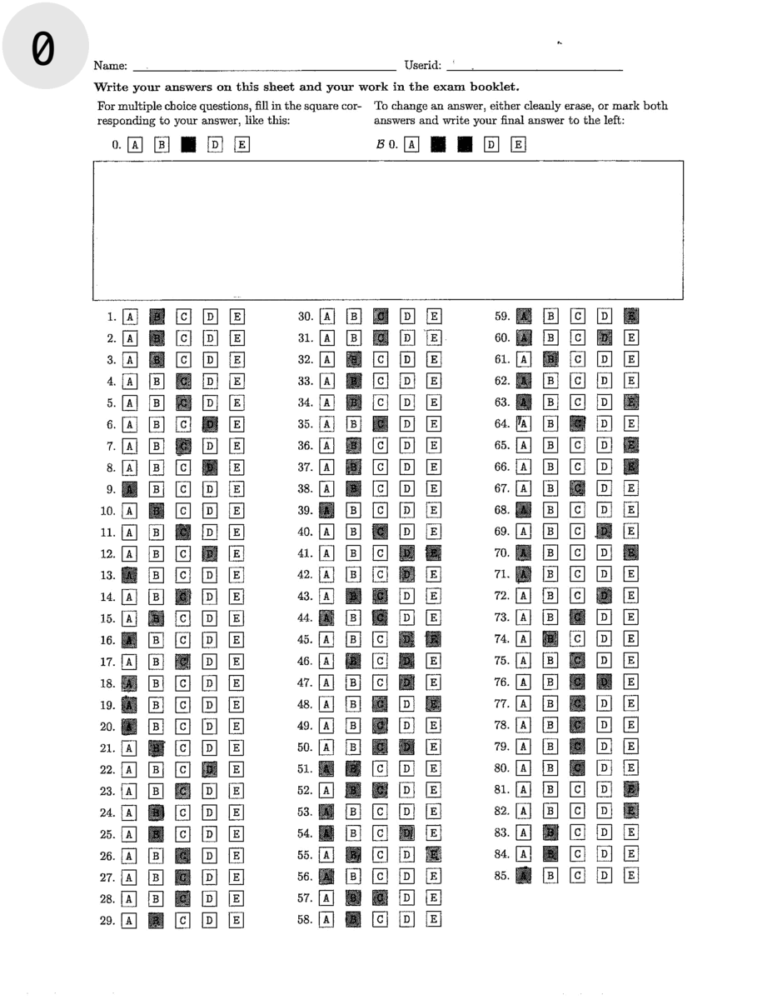

# Project Report

## Introduction
In this report, we present a comprehensive documentation of our approaches and outcomes for Assignment 1. The report is 
structured into 3 primary sections. Initially, we delve into image preprocessing, where we outline the procedures 
employed to prepare images for answer detection. Subsequently, we explore the answer detection phase where we explain 
the methodologies we used to identify answers within the preprocessed images. Finally, we discuss the process of answer 
injection/extraction.

Our approach is both efficient and robust. It processes individual forms in under 3 seconds, maintaining high accuracy 
with only two errors identified across the entire test dataset. This underscores the effectiveness and reliability of 
our approach in handling tasks with precision and speed.

## Preprocess
This animation showcases the key stages of our preprocessing algorithm. In this section, we will provide a frame by 
frame explanation of each major step of our approach.

## Question Detection

## Answer Inject/Extraction

## Conclusion

## Member Contributions
