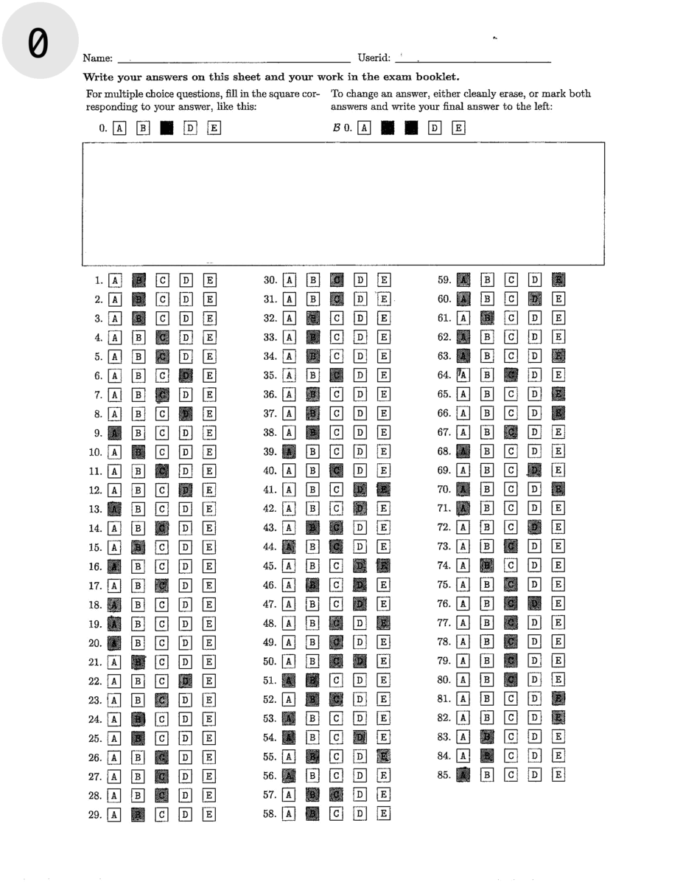
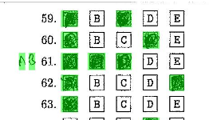
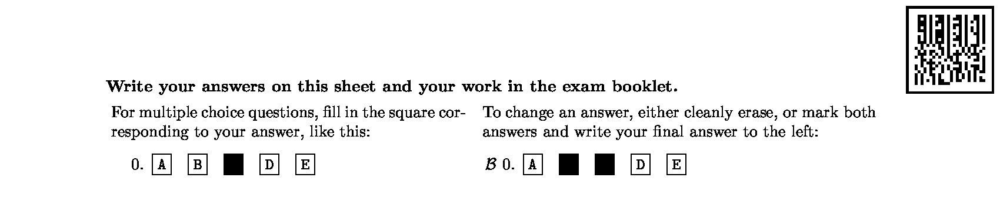
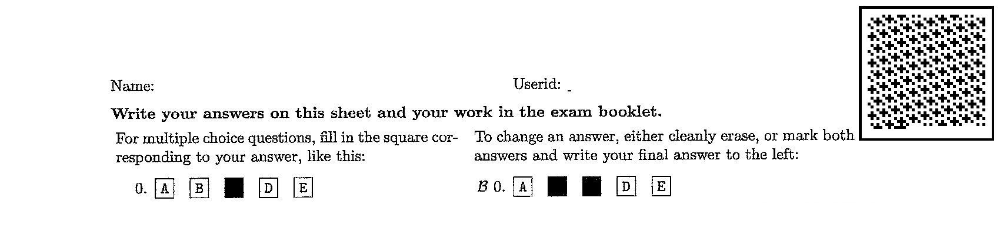
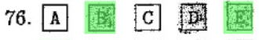
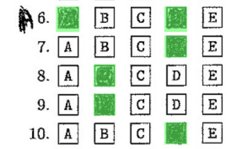
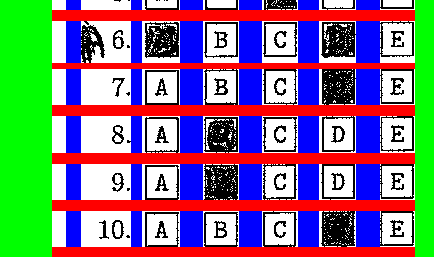

# Project Report

## Introduction
In this report, we present a comprehensive documentation of our approaches and outcomes for Assignment 1. The report is 
structured into 3 primary sections. Initially, we delve into image preprocessing, where we outline the procedures 
employed to prepare images for answer detection. Subsequently, we explore the answer detection phase where we explain 
the methodologies we used to identify answers within the preprocessed images. Finally, we discuss the process of answer 
injection/extraction.

Our approach is both efficient and robust. It processes individual forms in under 3 seconds, maintaining high accuracy 
with only two errors identified across the entire test dataset (Over 99% per-question accuracy). This highlights the effectiveness and reliability of 
our approach in handling tasks with precision and speed.

### Assumptions
Before we start we make 3 main assumptions about the data:
* **Every image has the same size:** `1700x2200 px`. Although our algorithms can still work with various sizes as we do not rely on specific pixel coordinates in the image, we have not tested algorithm for such cases.
* **Same general form layout.** Although our algorithm can still work with different amount of questions per form, it still requires 3 main answer columns in order to function. Any other major structural changes to form layout will cause our model to fail.
* **Minimal distortion in the image.** Although our algorithm is robust enough to work around the minor distortion of the test dataset, transformations like large rotations (more than a few degrees), perspective changes and heavy image compression will cause our model to fail. 

## Preprocess
This animation showcases the key stages of our preprocessing algorithm. In this section, we will provide a frame by 
frame explanation of each major step of our approach. The step number is specified in the top left of the animation.
We use different colors for different steps of preprocessing for easy visualization.



### Step 0-1
These steps include removing the header of the form and converting every pixel to either pure white or pure black. We 
achieve this by setting a threshold value, which allows us to categorize each pixel as either pure white or black based 
on its brightness.

### Step 2-4
These steps include to the column elimination phase, where we remove columns primarily composed of white pixels by 
coloring them blue. We have a tolerance of a few black pixels for every column so noise pixels can still be removed. 
At steps 3 and 4 we do additional passes where we remove very small lingering columns that most likely does not contain
any meaningful information (Notice small white column gaps in the image).

### Step 5
This step includes finding the columns that actually contain the answers. We do this by finding the top 4 widest removed
column from the previous steps. Our assumption is that the widest gaps in the form correspond to the spaces between each 
column of questions. We color these columns green to differentiate  from the rest of the removed columns. After this 
step every column that is not green most likely contain answers of the student.

### Step 6-11
At this stage we are left with 3 main columns that contain the student's answers. In these steps we attempt to detect
the question rows by replacing the whitespace rows by red. Similar to column detection, we have a few pixel tolerance so
if the marked square is slightly overflowing the borders of the box, we can still separate them. We process every 
question column separately so the rows can be seperated more precisely for every column. Similar to the column processing 
we do multiple passes for every row to remove any small spaces that most likely does not contain any meaningful 
information (Notice the small white rows close to the header).

### Step 12
We pass the preprocessed image to the grader.

## Answer Detection (Grader)
The answer detection algorithm receives a preprocessed image along with the locations of the question columns, 
identified as the non-green columns. Because the student can write text to the left of every question the index of the 
marked answers are not constant. That's why we start processing every question from the last index (Box for option E) 
and check the last 5 spaces. We define a threshold to determine if a box is marked or not. 

We assume that the 6th from the last index contains the question number. Any spaces beyond this may contain student 
writing. To determine this we define a separate threshold to check any spaces left of the question number 
(if it exists). We highlight the student's answers like the following:




## Answer Inject/Extraction
To inject and extract answers from the image we implement a simple barcode system. The barcode is added to the top right 
of the image. Here is how the barcode looks after injection:




To generate the barcode we have to first encode the information in binary sequence. However, simply converting every 
selected option to their direct binary equivalence would result in a significantly long sequence (8 bits per character).
To minimize the encoded message we define the following mapping: 

```python
ALPHABET_TO_BINARY = {
    'A': '000',
    'B': '001',
    'C': '010',
    'D': '011',
    'E': '100',
    ' ': '101', # <--- Seperator
}
```

Given that we only need an alphabet of size 6 to encode the entire answer sheet (five options and a separator character for 
different questions), encoding the entire answer document on the sheet requires merely 3 bits per character. This compact 
encoding scheme allows for efficient representation of all potential answers.

Our barcode does not have a constant size. That's why we also include a box around the barcode. When extracting the info
from the barcode we can simply find the bounding box of this box to extract the barcode itself. After the barcode is
extracted from the original image, recovering the encoded info is trivial.

To enhance the robustness of the barcode and to ensure its readability even under image compression, we allocate a 5x5 
pixel area for each encoded bit within the barcode. We intentionally designed the size of our barcode so that even in 
scenarios where the barcode reaches its maximum size (i.e., when every option is selected for every question) it still 
fits to the whitespace in the header as shown below.



## Points of Failure
Our approach is not foolproof. In this section we will talk about observed and potential flaws of our approach.


### Observed Failures
The first mistake observed is the models fails to detect one of the marked options. This can simply be solved by 
lowering the threshold value for detecting the options. However, if we further lower the threshold this would also cause
for other false positive classifications in other parts of the image. So this causes more problems than it solves. 
Another approach we tried was adding a slight blur to the form. Unfortunately, this solution also reduced the 
accuracy of our model because our preprocessing implementation is not designed to handle blurred images so, it fails
to find some columns or rows.



Another observed failure of our model is a special case where the students write the answer too close to the question number
in any of the first 10 question. As it is shown in the bottom images, our preprocessing algorithm fails to separate the
question number from the student answer because the handwritten 'A' is in the same column as the 10th question number.

 

This is mostly a problem in the first 10 questions because of the single digit question numbers. We have not observed
a problem anywhere else in the form because the column widths are roughly the same for the rest of the questions. We
attempted to solve this problem by adding another column pass for individual questions to detect and fix cases like
this. However, we quickly realised such a solution would increase the complexity of our algorithm exponentially because
it introduced countless other cases to consider. At the end, we decided that a more general approach would be better for 
our overall accuracy so, we decided not address this specific problem.

### Potential Failures
In this section, we acknowledge the potential for specific scenarios that, while not observed in our test cases, could 
still feasibly occur and affect the accuracy model.

Our model heavily relies on width length to find the question columns in the form. If a students writes too far away
from the question number that could mess with the extracted column widths and our preprocessing algorithm may fail to
find proper locations of the answers. Similarly, if the student writes too close to the question index, this could also
cause similar problem explained in the previous section.

Another potential challenge arises from the way students mark their answers. Excessive overflow in their markings, to 
the extent that it merges with neighboring boxes, could complicate the model's ability to accurately interpret 
individual responses. Although we have incorporated a degree of tolerance to mitigate this issue, an excessive presence 
of such cases could still pose significant challenges to the model's effectiveness.

## Contributions of the Authors
**Cakiroglu, Mert Onur:** Designed preprocessing algorithm, Implemented barcode inject/extract answers.

**Kovi, Jagadeesh:** Implemented answer detection algorithm.

**Adelekan, Ade Emmanuel:** Experimented with different ideas for inject/extract.

